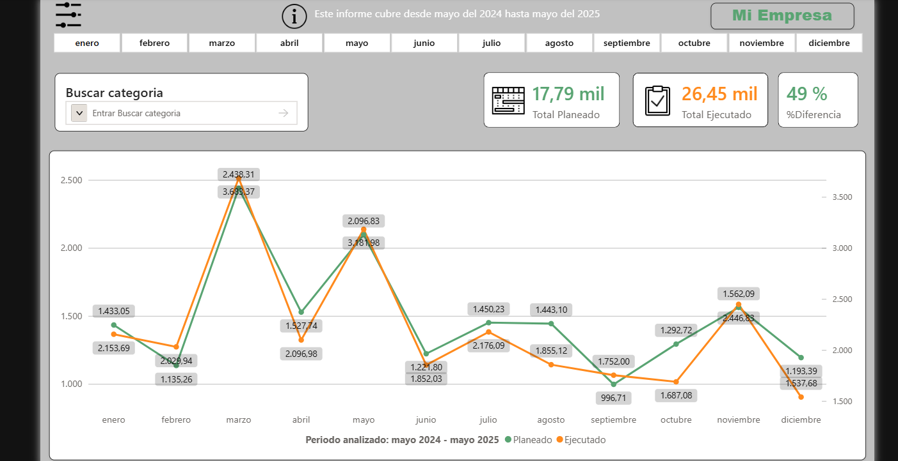

# Dashboard de Planeación y Ejecución de Recursos Tecnológicos

[English](README.md) | [Español](README.es.md)

##  Descripción
Dashboard interactivo desarrollado para analizar la diferencia entre las horas planeadas y las horas ejecutadas dentro del área de tecnología de una empresa.

El proyecto integra información proveniente de múltiples fuentes de datos, incluyendo SQL Server y Smartsheet, con el objetivo de evaluar cómo se estaban gestionando los recursos y la asignación de proyectos entre diferentes áreas tecnológicas.

El principal objetivo fue identificar desviaciones en la planeación, medir la dedicación de recursos por proyecto y área, y proporcionar información analítica para apoyar la toma de decisiones.

---

## Tecnologías Utilizadas
- Power BI
- SQL Server
- SQL
- DAX
- Power Query
- Smartsheet

---

## Integración de Datos
El dashboard consolida información proveniente de diferentes fuentes:

### Smartsheet
- Horas planeadas
- Asignación de proyectos
- Distribución de recursos por líderes de área

### SQL Server
- Horas ejecutadas registradas diariamente en una aplicación interna de la empresa
- Registros históricos operativos
- Seguimiento de ejecución por proyecto

Debido a las diferencias estructurales entre las bases de datos, fue necesario realizar procesos de transformación, limpieza y normalización de datos para relacionar correctamente la información.

---

## Funcionalidades del Dashboard
- Filtros dinámicos por:
  - Año
  - Mes
  - Categoría
  - Proyecto
- Búsqueda interactiva por nombre o categoría
- Diagramas de líneas para visualizar desviaciones y tendencias
- Comparación entre:
  - Horas planeadas
  - Horas ejecutadas
  - Variación porcentual
- Tabla detallada por:
  - Persona
  - Proyecto
  - Área
  - Total de horas
- Análisis histórico mensual durante un periodo de un año
- Monitoreo simultáneo de aproximadamente 200 colaboradores

---

## Objetivo del Negocio
Brindar visibilidad sobre el uso de recursos tecnológicos y validar si la planeación realizada por los líderes coincidía con la ejecución real de los proyectos.

El dashboard permitió:
- Detectar sobrecarga o baja utilización de recursos
- Identificar inconsistencias en la planeación
- Analizar la dedicación por áreas y proyectos
- Mejorar futuras estrategias de planificación basadas en datos históricos

---

## Habilidades Aplicadas
Durante este proyecto fortalecí conocimientos en:
- Análisis y visualización de datos
- Desarrollo de dashboards en Power BI
- Consultas y análisis en SQL
- Integración y modelado de datos
- Construcción de KPIs
- Pensamiento analítico para la toma de decisiones
- Planeación de recursos basada en datos

---

## Vista Previa

---

## ⚠️ Nota Importante
Este proyecto es una versión demostrativa desarrollada con datos y archivos dummy con el fin de mostrar parte del trabajo realizado durante mis prácticas profesionales.

La información, nombres, registros y estructuras utilizadas fueron adaptadas o anonimizadas para proteger la confidencialidad de los datos reales de la empresa.

---
